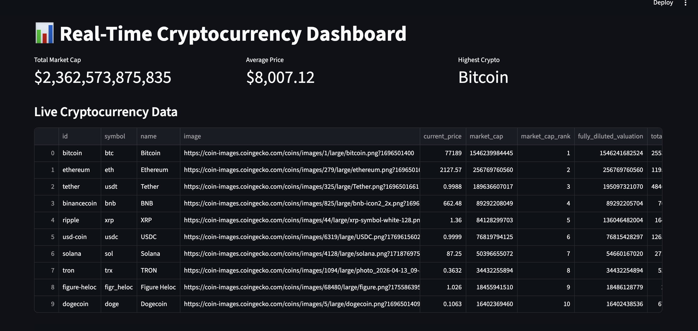
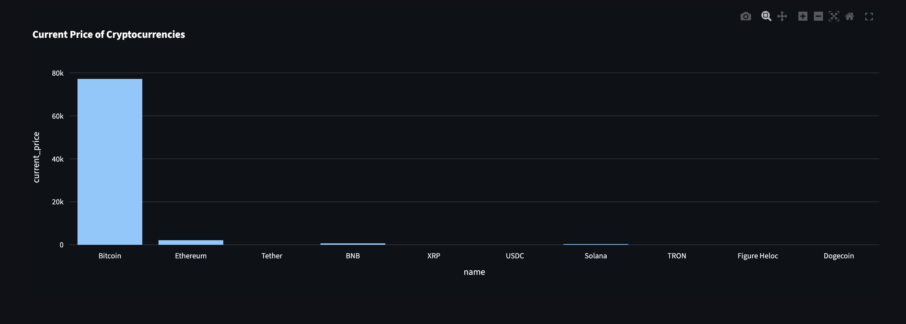
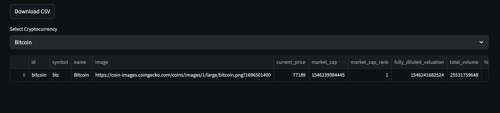
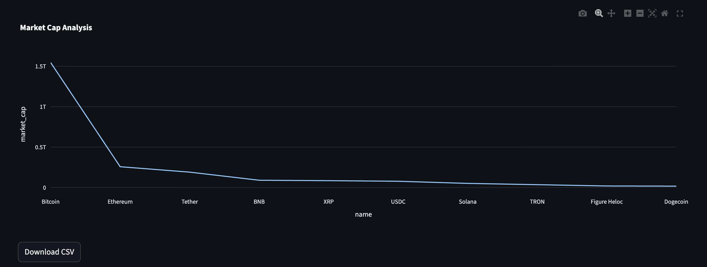

# 📊 Real-Time Cryptocurrency Dashboard

A real-time cryptocurrency analytics dashboard built using Python, Streamlit, Pandas, and Plotly.

---

# 🚀 Features

- Live cryptocurrency price tracking
- KPI metrics dashboard
- Interactive charts
- Market trend analysis
- CSV export functionality
- Real-time API integration
- Responsive dashboard UI

---

# 🛠️ Technologies Used

- Python
- Pandas
- NumPy
- Streamlit
- Plotly
- Matplotlib
- Requests API

---

# 📂 Project Structure

real-time-crypto-dashboard/
│
├── data/
├── screenshots/
├── app.py
├── api.py
├── analysis.py
├── requirements.txt
└── README.md

---

# 📸 Dashboard Screenshots

## Main Dashboard

---

## Charts Section

---

## Report Section

---

## Trends Section

---

# ⚙️ Installation

## Clone Repository

git clone https://github.com/aryan4505/Real-Time-Cryptocurrency-Dashboard

---

## Navigate To Folder

cd real-time-crypto-dashboard

---

## Install Dependencies

pip install -r requirements.txt

---

## Run Application

streamlit run app.py

---

# 📈 Future Improvements

- Machine learning prediction
- SQL database integration
- Docker deployment
- User authentication

---

# 👨‍💻 Author

Aryan Diwan